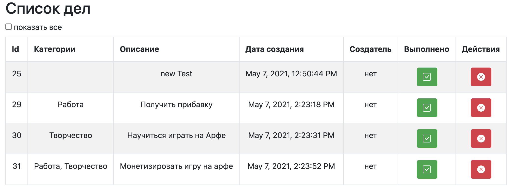

# Todo list Single Page Web application

## Functionality:

- Web Application Interface 
- Create new Task Item
- Delete Item
- Update Item Done Status
- List All Items
- List Done Items

## Main Interface 

### Add new Item interface 

### List All Items

### List Done Items

### Used technologies:

- Maven
- JDBC 
- Hibernate 
- Slf4j
- JUnit 4 
- Postgres
- Servlet
- Travis CI
- Lombok   
- Jacoco
- Checkstyle
- Html + JS + AJAX + Css
- Twitter Bootstrap